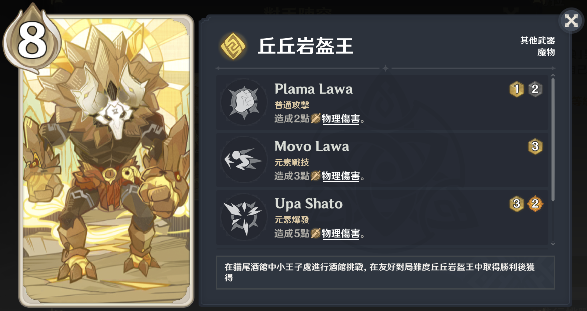

# 《七圣召唤》中卡牌的丘丘语技能

## [丘丘岩盔王](https://bbs.mihoyo.com/ys/obc/content/919/detail)

### Plama Lawa 王之挥拳

从右向左挥动手臂出拳。

### Movo Lawa 王之猛冲

身体下蹲，然后突然往前猛冲。

### Upa Shato 遮天蔽日

跳起来，然后双拳向前方打下去。

## [火斧丘丘暴徒](https://bbs.mihoyo.com/ys/obc/content/383/detail)

### Du Plama 挥砍两次

从左向右挥动斧头劈一次，然后从上往下挥动斧头劈一次，一共劈两次。

### Upa 旋转升天

一边旋转身体，一边挥动斧头。

### Oto Tiga

跳起来，然后向前方重重劈下去。

## [冰盾丘丘人](https://bbs.mihoyo.com/ys/obc/content/1366/detail)

### Plata Plama 挥拳打击

从右向左挥动手臂出拳。

### Da Plama 有力的挥盾

从右向左挥盾。

### Aba Movo 往前冲

手持冰盾往前冲，停下时从左向右挥盾。

